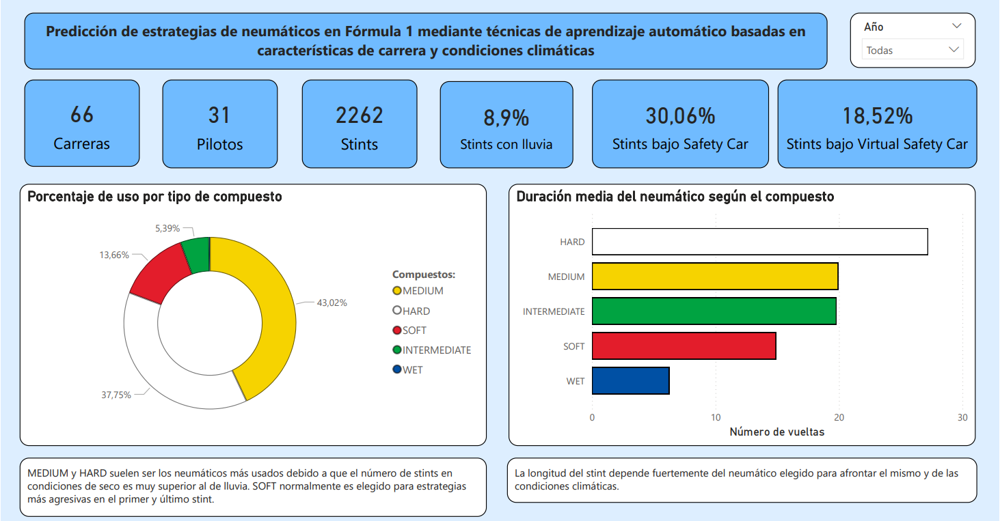
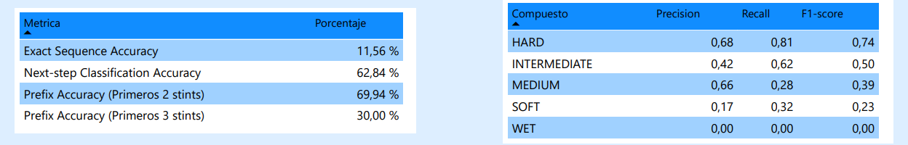

# **Formula 1 Strategy Prediction**
### **Deep Learning aplicado a la predicción de paradas (Pit Stop) y elección de neumáticos**

Este proyecto utiliza redes neuronales recurrentes para anticipar las decisiones estratégicas de los equipos de Fórmula 1, analizando factores climáticos, telemetría y comportamiento de neumáticos en tiempo real.

## **1. El Problema de Negocio**
En la Fórmula 1, la estrategia de neumáticos es el factor diferencial entre la victoria y la derrota. El objetivo de este modelo es procesar secuencias de datos históricos para predecir:

* El momento óptimo de la parada (Pit Stop).

* El compuesto más adecuado para el siguiente stint (Hard, Medium o Soft).

## **2. Análisis Exploratorio de Datos (EDA)**
Se ha realizado un análisis exhaustivo de **66 carreras** y más de **2.200 stints** utilizando la API de OpenF1. Este análisis permite identificar patrones clave, como el dominio de los compuestos Medium y Hard en estrategias de carrera y el impacto de factores externos como el Safety Car.

Dashboard de análisis estratégico: Se observa la distribución del uso de compuestos y la duración media de los mismos según las condiciones de pista.

## **3. Stack Tecnológico**
* **Extracción**: OpenF1 API.

* **Procesamiento**: Python (Pandas, NumPy).

* **Deep Learning**: PyTorch (Arquitectura LSTM).

* **Interpretabilidad**: SHAP (Explica el peso de variables como el desgaste y el tiempo del rival).

* **Visualización**: Power BI.

## **4. Modelado y Rendimiento (LSTM)**
Para capturar la naturaleza secuencial de una carrera, se implementó una red **Long Short-Term Memory (LSTM)**. A diferencia de los modelos tradicionales, la LSTM permite "recordar" lo sucedido en las vueltas anteriores para predecir el futuro de la carrera con mayor precisión.

Métricas de rendimiento: El modelo destaca con un **Recall del 81%** en neumáticos Hard y una **precisión del 69,94%** en la predicción de los dos primeros pasos de la estrategia (Prefix Accuracy).

## **5. Conclusiones y Valor Añadido**
* **Robustez en Secuencias**: El modelo ha demostrado ser 10 veces más preciso que un modelo base en la clasificación de secuencias exactas.

* **Explicabilidad (XAI)**: Gracias a la integración de SHAP, el modelo no es una "caja negra"; permite a los ingenieros entender qué factores (lluvia, posición en pista, etc.) están motivando la predicción.

Este proyecto es el resultado de mi Trabajo de Fin de Máster (TFM) en Data Science.

